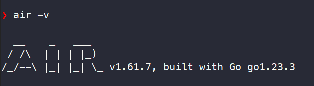

## Golang

https://go.dev/tour/welcome/1


# module
***Khai bao module***
go mod init cmsgo

*** keo nhung package moi ***
go mod tidy

## install air

```bash
go install github.com/air-verse/air@latest
```
cmd : air -v


